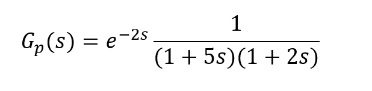
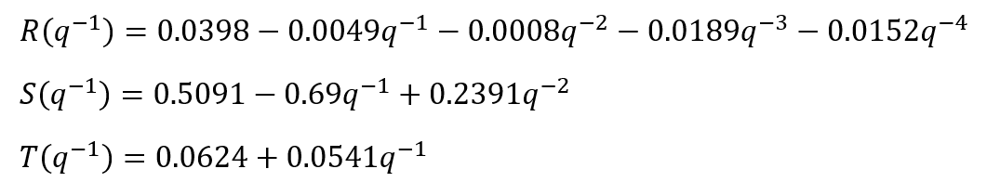
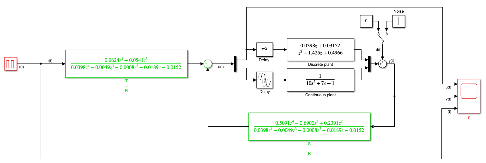
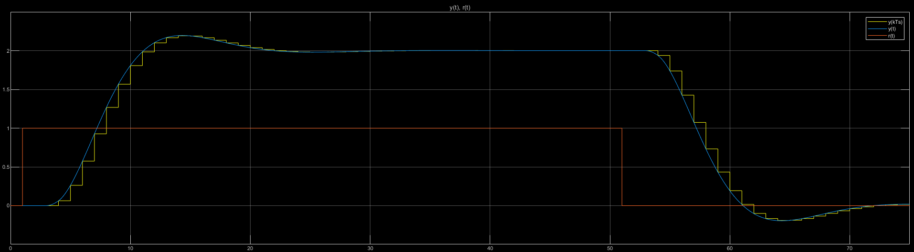

# RstController
Predictive control using a polynomial representation. It is based on second order continuous plant with transport delay.
Project was prepared with Matlab 2020b and Simulink environment. 

## Example
For presentation purposes, below transfer function was analysed:

  

Following design requirements were assumed:
 - sampling time **Ts = 1s**
 - static gain **ks = 2**
 - rise time **Tn = 5s**
 - max overshoot **Mp < 10%**

With usage of *desgin_controller.m* below polynomials of predictive controller were calculated:

  

File *simulation/simulink_model.slx* contains whole control system model with both continuous and discrete plants and RST controller. Moreover, there is possibility to add noise signal to model output. Schema of simulink model for above transfer function:

  

Results of given example:

  

